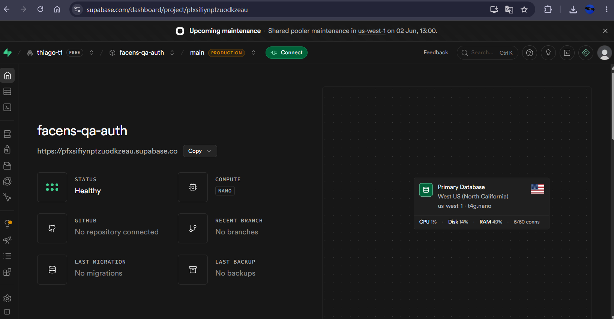
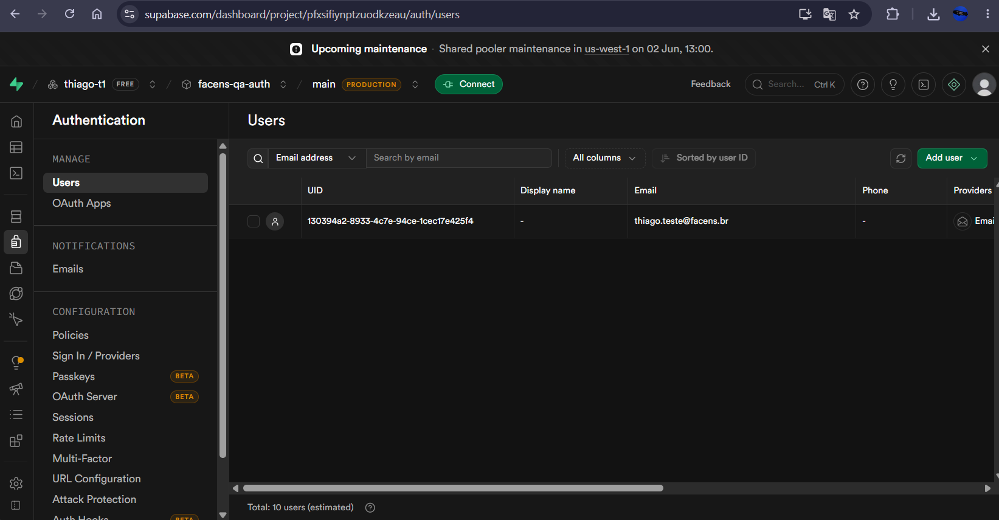
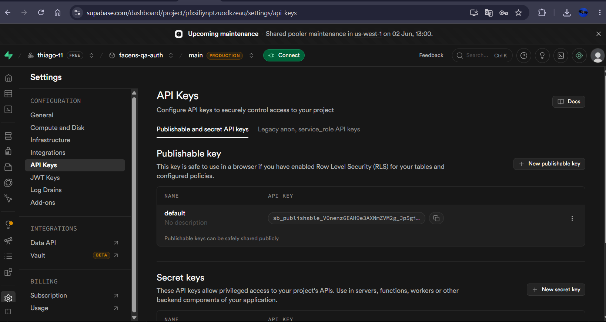
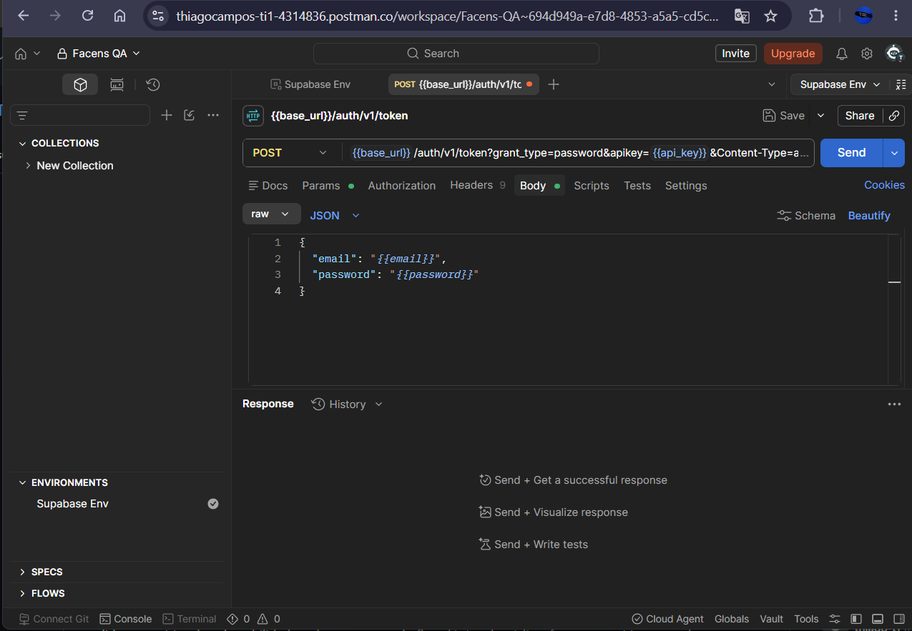

# Introdução
Esta documentação detalha a execução técnica de testes funcionais em APIs, com foco na metodologia de Teste de Caixa Cinza. O escopo abrange a validação de rotas de autenticação, desde a configuração da infraestrutura de backend (BaaS) até o disparo de requisições e análise de retornos HTTP em diferentes cenários de uso.

# Objetivo da Atividade
O objetivo central é configurar um ambiente real de autenticação na nuvem e validar suas regras de negócio através de testes funcionais. A atividade busca fixar conceitos essenciais de Qualidade de Software, como validação de Headers, montagem de payloads JSON, interpretação de status HTTP e gestão de variáveis de ambiente no ciclo de testes de uma API Restful.

# Configuração do Supabase
Para prover o ambiente de autenticação (BaaS), foi inicializado um novo projeto no Supabase chamado `facens-qa-auth`. 
* **Autenticação:** Foi habilitada a autenticação via *Email/Password* no painel de *Providers*.
* **Criação de Usuário:** Um usuário de testes foi provisionado diretamente no painel de *Authentication* (`thiago.teste@facens.br`) para servir de massa de dados válida.
* **Objetivo:** O objetivo dessa configuração foi gerar as chaves de API (`API KEY`) e o Endpoint base (`Project URL`) para simular um ambiente de produção seguro, sem a necessidade de codificar o backend do zero.

### Evidências do Supabase




# Configuração do Postman
No Postman Desktop, a organização foi feita garantindo o isolamento dos dados de teste:
1. Um **Workspace** foi criado especificamente para a disciplina de UX/UI e Testes.
2. Um **Environment** foi configurado para armazenar as credenciais, garantindo que chaves sensíveis não fiquem fixas (*hardcoded*) nas requisições.
3. **Finalidade das variáveis:** 
   * `base_url`: Aponta para a rota raiz do Supabase (`https://pfxsifiynptzuodkzeau.supabase.co`).
   * `api_key`: Autoriza a comunicação com o projeto específico.
   * `email` e `password`: Massa de dados automatizada para o fluxo de sucesso.

### Evidências do Postman e Requisição


# Configuração das Requisições
A requisição foi arquitetada para se comunicar com o endpoint de geração de tokens de sessão.
* **Endpoint:** `/auth/v1/token?grant_type=password`
* **Método:** `POST`
* **Finalidade:** Validar as credenciais fornecidas no corpo e devolver um token de acesso JWT em caso de sucesso.

**Headers Utilizados:**
| Header | Valor |
| :--- | :--- |
| `apikey` | [Ocultado por segurança] |
| `Content-Type` | `application/json` |

**Body JSON Utilizado:**
```json
{
  "email": "thiago.teste@facens.br",
  "password": "Teste123456!"
}

Execução dos Testes
Os testes de Caixa Cinza foram executados submetendo a API a cenários previstos e imprevistos, validando se a resposta do servidor correspondia às regras de negócio de autenticação.

Evidências dos Testes
Registro dos Testes
Os testes foram documentados em uma planilha técnica de QA. Esta documentação é crucial no ciclo de desenvolvimento porque garante rastreabilidade, padroniza as validações para futuros testes de regressão e facilita a comunicação de bugs para a equipe de desenvolvimento.

Evidência da Planilha
Resultados Obtidos
A API do Supabase demonstrou alta resiliência e estabilidade durante os testes funcionais. O serviço tratou perfeitamente todos os Bad Requests, emitindo códigos de status HTTP corretos (família 4xx) e mensagens em JSON descritivas sobre os erros, impedindo o avanço de credenciais anômalas e gerando o access_token JWT exclusivamente no cenário principal com credenciais válidas.

Conclusão
A execução correta de todos os testes confirmou que a autenticação foi configurada e responde conforme esperado. A principal dificuldade encontrada foi garantir a exatidão das variáveis no Environment do Postman, pois qualquer erro de sintaxe nos Headers causava recusa na comunicação.
Esta atividade atestou a importância brutal do Teste de Caixa Cinza em APIs. Ao conhecermos os dados de entrada e a estrutura dos retornos, conseguimos simular o comportamento de um frontend real antes mesmo dele existir, garantindo que o backend está blindado contra falhas lógicas e estruturais.

✒️ Autor
Thiago